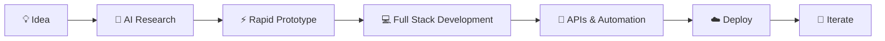

<div align="center">


<br/>

<a href="https://github.com/shriyash2006">

</a>

<br/><br/>

<a href="https://github.com/shriyash2006">

</a>
<a href="https://github.com/shriyash2006?tab=followers">

</a>

</div>

---

## 👋 About Me

I'm **Shriyash Sahu**, a Computer Science & Engineering student at **VIT**, focused on building software products with **AI, modern web technologies, and automation**.

I enjoy taking an idea from **concept → prototype → working product**, often using AI-assisted development and rapid experimentation.

```text
AI Engineer       → LLMs • Generative AI • AI Applications
Vibe Coder        → AI-assisted development • Rapid prototyping
Full Stack        → Next.js • React • FastAPI • Supabase
Cloud             → AWS • Vercel • Google Cloud
Automation        → n8n • APIs • AI workflows
Builder           → Products • Experiments • Open Source
```

### 🚀 What I'm Building

* 🤖 AI-powered applications and intelligent workflows
* 🌐 Full-stack web products with modern architectures
* ⚡ Rapid prototypes using AI-assisted development
* 🔗 API-driven applications and automation pipelines
* 🧠 Experiments with LLMs, Generative AI and AI agents
* 🛠️ Developer tools and productivity-focused products

---

## 🧠 My Tech Stack

### Languages

<p align="center">


</p>

### Frontend & Full Stack

<p align="center">


</p>

### Backend & Databases

<p align="center">


</p>

### AI / GenAI

<p align="center">


</p>

<p align="center">


</p>

### Cloud, DevOps & Tools

<p align="center">


</p>

<p align="center">


</p>

---

## 🛠️ How I Build



I like keeping the development loop simple:

**Think → Build → Test → Deploy → Improve**

---

## 🌟 Featured Project

### ✍️ ScriptLyra

**ScriptLyra** is a modern publishing platform designed around **articles, blogs and creator-focused content**, combining a clean reading experience with modern web technologies.

<p align="center">

<a href="https://scriptlyra.vercel.app">

</a>

</p>

**Stack**

`Next.js` `React` `Supabase` `JavaScript` `Vercel` `GitHub`

**Focus**

* 📝 Publishing & article creation
* 👤 User authentication
* 🔐 Backend services
* ☁️ Cloud deployment
* 🎨 Minimal, modern UI
* 🚀 Product-oriented development

---

## 🤖 AI Engineering

My current focus is increasingly around building practical software with AI rather than treating AI as a standalone technology.

### Areas I'm Exploring

| Area               | Focus                                    |
| ------------------ | ---------------------------------------- |
| 🧠 Generative AI   | LLM-powered applications                 |
| 🤖 AI Agents       | Tool-using & automated workflows         |
| 🔗 AI + APIs       | Connecting models with real applications |
| ⚡ AI Development   | Rapid product prototyping                |
| 🔄 Automation      | n8n + APIs + AI workflows                |
| ☁️ Cloud AI        | Google Cloud / Vertex AI                 |
| 📄 Multimodal AI   | Documents, text & visual understanding   |
| 🛡️ Responsible AI | Privacy, safety & responsible deployment |

---

## 📊 GitHub Activity

<div align="center">


</div>

<br/>

<div align="center">


</div>

---

## 🏆 GitHub Achievements

<div align="center">


</div>

---

## 📈 Contribution Graph

<div align="center">


</div>

---

## 🧩 Projects & Experiments

Some of the things I've worked on include:

* 🤖 **AI-BUDDY** — AI-focused application / experimentation
* 📝 **ScriptLyra** — Publishing & article platform
* 🔄 **Missed-Class-Recovery-Engine** — Productivity / automation project
* 💻 **Badmosh-Coder-Startathon** — Development project
* 🌐 **Campus-TaaS** — Campus-focused software project
* 🧪 Various AI, automation and full-stack experiments

> I believe the best way to learn technology is to **build with it**.

---

## ☁️ Cloud & AI Learning

<div align="center">

<a href="https://www.cloudskillsboost.google/">

</a>


</div>

---

## 🎯 Currently

```text
🔨 Building        → AI-powered products
🧠 Learning        → AI Engineering & modern software architecture
⚡ Experimenting    → Vibe Coding & AI-assisted development
☁️ Exploring       → Cloud & scalable applications
🔄 Automating      → AI + APIs + n8n workflows
🚀 Improving       → Product development & engineering skills
```

---

## 🤝 Let's Connect

<div align="center">

<a href="https://www.linkedin.com/in/shriyash-sahu/">

</a>

<a href="https://github.com/shriyash2006">

</a>

<a href="https://scriptlyra.vercel.app">

</a>

<a href="https://x.com/shriyash_2006">

</a>

</div>

<br/>

<div align="center">

### 💭 Build fast. Learn constantly. Ship something meaningful.

<br/>


</div>
